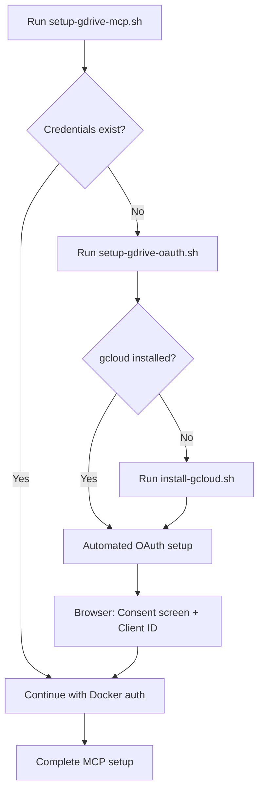

# Google Drive OAuth Automation

This document describes the automated Google Drive OAuth setup that minimizes manual browser interaction and follows the "Snowball Method" for continuous improvement.

## Overview

The automation consists of three integrated scripts:

1. **`setup-gdrive-mcp.sh`** - Main MCP server setup (existing, now enhanced)
2. **`setup-gdrive-oauth.sh`** - Automated OAuth credential setup (new)
3. **`utils/install-gcloud.sh`** - Cross-platform gcloud CLI installation (new)

## Automation Flow



## What Gets Automated

### ✅ Fully Automated
- gcloud CLI installation (cross-platform)
- Google Cloud project creation/selection
- Google Drive API enablement
- OAuth client ID creation setup
- Docker image building
- MCP server configuration

### 🔄 Semi-Automated (Minimal Browser Interaction)
- OAuth consent screen configuration
- OAuth client ID download
- Initial Google account authentication

### ❌ Still Manual (Cannot be automated)
- Google account login
- OAuth consent screen approval
- Client credentials download

## Known UX Issues (To Fix)

### ⚠️ Confusing Input Prompt

### ⚠️ Corporate Environment Project Flood
**Issue**: In large corporations with thousands of Google Cloud projects, the project list floods the terminal and breaks input handling.

**Current behavior**: 
- Script shows "Available projects:" then lists ALL projects
- Takes 5+ seconds to scroll through thousands of project names
- User input gets concatenated (typing before + during + after flood)
- Clear prompts like "WAITING FOR INPUT" get buried in the flood
- Additional 5-second delay before flood even starts

**Impact**: 
- Impossible to see when to type input
- Input gets corrupted by concatenation
- User experience is completely broken in large orgs

**Workaround**: 
1. Wait for the entire project flood to finish scrolling (10+ seconds total)
2. Look for the buried ">>> TYPE PROJECT ID HERE <<<" prompt
3. Type your project ID: `gdrive-mcp-shared-acces`
4. Press Enter

**Better solution needed**: 
- Limit project list to first 10-20 projects
- Add search/filter capability
- Or skip project listing entirely if user provides project ID as argument
**Issue**: When `setup-gdrive-oauth.sh` shows the project list, it's not immediately obvious that the script is waiting for user input.

**Current behavior**: 
- Shows "No default project set." in yellow
- Shows "Available projects:" in blue  
- Lists all projects
- **Then silently waits for input** without clear indication

**Expected behavior**:
- Clear "WAITING FOR INPUT" message
- Obvious prompt like ">>> TYPE PROJECT ID HERE <<<"
- Visual separation between project list and input prompt

**Workaround**: After seeing the project list, type your project ID (e.g., `gdrive-mcp-shared-acces`) and press Enter.

## Usage

### Simple Usage (Recommended)
```bash
cd ~/ppv/pillars/dotfiles/mcp
./setup-gdrive-mcp.sh
```

The script will automatically detect missing components and guide you through the setup.

**When prompted for project selection:**
1. Look for `gdrive-mcp-shared-acces` in the project list
2. Type exactly: `gdrive-mcp-shared-acces`
3. Press Enter
### Advanced Usage
```bash
# Test automation components
./test-gdrive-oauth-automation.sh

# Run OAuth setup independently
./setup-gdrive-oauth.sh

# Install gcloud CLI only
../utils/install-gcloud.sh
```

## What You Need to Provide

1. **Google Account** - For authentication and project access
2. **Browser Access** - For OAuth consent screen and client ID creation
3. **Docker** - Must be installed and running

## Benefits of This Approach

### Following Dotfiles Philosophy
- **Spilled Coffee Principle**: All setup is scripted and reproducible
- **Snowball Method**: Each run improves the automation and reduces manual steps
- **Modular Design**: Separate utilities for different concerns

### Technical Benefits
- Cross-platform gcloud installation
- Automatic project and API management
- Integrated error handling and fallbacks
- Minimal browser interaction required
- Self-restarting setup flow

## Troubleshooting

### Common Issues

1. **gcloud not found**
   - Automation installs it automatically
   - Manual: `brew install google-cloud-sdk` (macOS)

2. **Authentication failed**
   - Run: `gcloud auth login`
   - Ensure you have Google Cloud access

3. **Project creation failed**
   - May need billing enabled for new projects
   - Use existing project instead

4. **OAuth consent screen issues**
   - Use "Internal" type for testing
   - Add required scope: `https://www.googleapis.com/auth/drive.readonly`

### Debug Mode
```bash
# Enable debug output
set -x
./setup-gdrive-mcp.sh
```

## Future Improvements

Following the "Snowball Method", potential enhancements:

1. **Terraform Integration** - Infrastructure as code for Google Cloud setup
2. **Service Account Support** - Eliminate OAuth flow for server environments  
3. **Multi-project Management** - Handle multiple Google Cloud projects
4. **Credential Rotation** - Automatic token refresh handling

## Files Created

The automation creates these files:
- `~/tmp/gdrive-oath/credentials.json` - OAuth client credentials
- Docker volume `mcp-gdrive` - Authentication tokens
- `~/.config/gcloud/` - gcloud CLI configuration

## Security Notes

- Credentials are stored locally, not in git
- OAuth tokens are stored in Docker volumes
- gcloud configuration uses standard Google security practices
- No hardcoded secrets in any scripts
